# MariaDB - JPA, JDBC, & Spring Boot

**Table of contents**

- [MariaDB - JPA, JDBC, \& Spring Boot](#mariadb---jpa-jdbc--spring-boot)
  - [Introduction](#introduction)
    - [Database Schema](#database-schema)
  - [How to install](#how-to-install)
  - [How to use](#how-to-use)
    - [AppJPA in the terminal](#appjpa-in-the-terminal)
    - [AppSpringBoot in Postman and Endpoints](#appspringboot-in-postman-and-endpoints)
      - [Create](#create)
      - [Get all](#get-all)
      - [Get one](#get-one)
      - [Update](#update)
      - [Delete](#delete)
  - [Testing](#testing)

## Introduction

This is an asignment made for the Databases assignature. We were asked to create a project of our choice using and combining the knowledge we adquired about [Plain and Pool Connection with JDBC](https://mariadb.com/resources/blog/how-to-connect-java-applications-to-mariadb-using-jdbc/), and [connection with JPA/Hibernate](https://dzone.com/articles/getting-started-with-jpahibernate) to a MariaDB database.

After thinking about it, we decided to try and create an API REST using Java, JPA, and Spring Boot. We hoped to use the logic we made with JPA to access the database (as it used also the Pool Connection of JDBC, which is better than a simple Plain Connection; and using the three of them at the same time would redundant), but when implementing the Spring Boot framework to construct the API REST, we realized that it was not possible, and ended up using the JPA version that already came with Spring Boot instead, which we found it was much more easy and intuive than the raw use of JPA with the use of the Hibernate ORM.

In the end, and to preserve our work with JPA, we ended up with two different `App` files: `AppJPA`, which works with the pure version of JPA/Hibernate; and `AppSpringBoot`, which initiates the Spring Boot API REST using the JPA version of Spring Boot. We'll talk about how each of them work in more detail below.

Finally, a mention of honor to [JLDJR2481](https://github.com/JLDJR2481) for the amazing work he did to make Spring Boot work. Good work, partner!   

  

### Database Schema

The database have three tables:   

- `programming_language`
- `dev_rating`
- `user_rating`

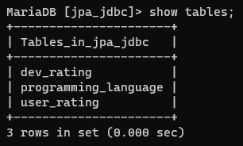   

The rating tables have the same values, and are used as reference for certain fields in the `programming_language` table. There are two fields:   

- **`rating`:** The rating of the language, which also acts as an ID.
- **`rating_comment`:** The qualification assigned to the rating.

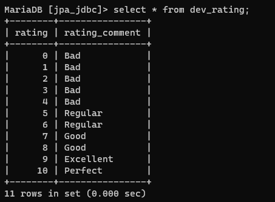   
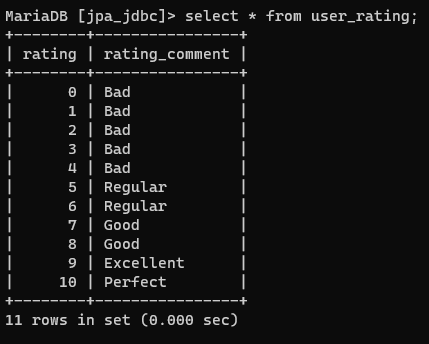   

The table `programming_language` have 4 fields:

- **`id`:** The ID of the programming language.
- **`name`:** The name of the programming language.
- **`dev_rating`:** The rating of the language given by a developer. This is a foreign key, referencing to the ID of the `dev_rating` table.
- **`user_rating`:** The rating of the language given by a user. This is a foreign key, referencing to the ID of the `user_rating` table.

   

## How to install

You will need to have already installed: `Git`, and `Docker`.   

1. First, open the terminal and go to the folder in which you desire to clone the repository. When you're inside, clone the repository:

    ```
    git clone https://github.com/ncocana/MariaDB-JPA-JDBC.git
    ```

2. Open the terminal and build the Docker image of the application by running the following command. This will create a Docker image with the tag "mariadb-springboot". Make sure you're in the same folder as the files' project before proceeding.   
   
    ```
    docker build -t mariadb-springboot .
    ```

    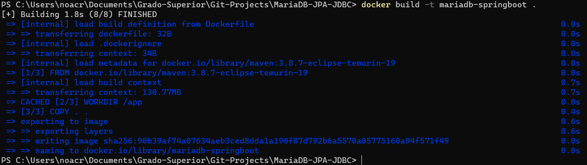 

    You can view the image created with the command: `docker images`.

    To remove the image, get its ID or name with the command from above and do this command: `docker rmi [image's ID or name]`. Using a random ID as example, the command would be as follow: `docker rmi ac6d8c993fa7`.

3. Now, run the Docker compose file using the following command:

    ```
    docker-compose up
    ```

    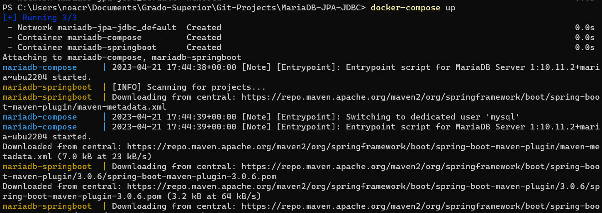 

    This will create the needed containers (one for the MariaDB database, and another for the application using the image you built before) and a network for the containers to connect with each other, as well as execute an `schema.sql` file to create the database that will be used by the application inside MariaDB. The application container is programmed to automatically run the JPA App to create the tables and insert some mock data, and then start the Spring Boot application (`AppSpringBoot.java`) when created. But you can still execute the `AppJPA.java` file separately if you get inside the container and use the command `mvn exec:java`. Further use of those will be explained in detail below.   

    You will know the containers are fully and ly created when you see a log saying "`Started AppSpringBoot`":

    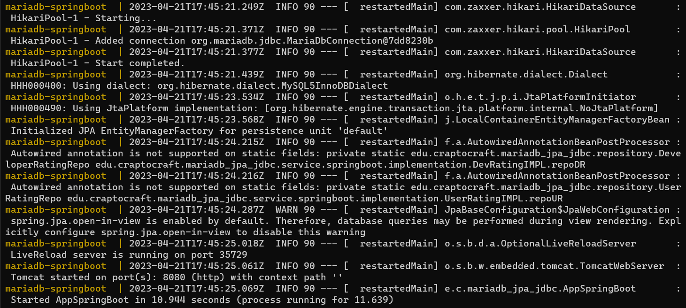 

    **IMPORTANT:** It's highly possible that you will get an error when executing for the first time `docker-compose up`. This seems to be due to the app being initialized before the database, resulting in the app not being able to get a connection because the database has not been properly initiated yet. To solve this, you only need to do `docker-compose up` a second time and it will work succesfully this time. The error you will find will be this:   

    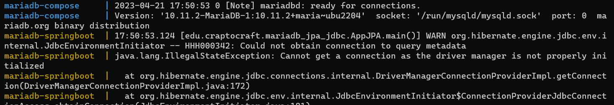 

    To cancel to stop the containers, pulse Ctrl + C. Then you can delete the containers and its network with:

    ```
    docker-compose down
    ```

    Additionally, if you don't want to see the container's logs, you can run the Docker compose file in the background of the terminal with: `docker-compose up -d`. The proccess to delete the containers and its network is the same as above.   

    You can view the container created with the command: `docker ps -a` (this will show you all the containers, running or not. To view only the ones running at the moment: `docker ps`).

    You can enter the container with: `docker exec -it mariadb-springboot bash`.

## How to use

### AppJPA in the terminal

The JPA App it's constructed to create the tables, introduce the default data in the rating tables, and insert some mock data on the `programming_language` table with example on how to show the data through the terminal, update, and delete it. And finally close the connection when finishing executing. The JPA App is also configured to create the table and expand it with new data if the table is created every time it executes itself. However, due to a try/except block, it will not create new data, instead it will create the tables if they do not exist and insert some mock data as well as try CRUD operations; after that, if the tables are already created, it will catch the exception and do nothing. This is due to the role that the JPA App plays in the succesfull execution of the Spring Boot App, which will be explained soon.   

If you wished to use this option to connect to the database, you would have to personalize the code yourself (as well as delete the try/except statement preventing it from executing a second time as to not insert duplicated data), which can be cumbersome and not-user-friendly at the long run. It's due to this that we ended up using Spring Boot to create a more user-friendly use of the application. **However,** due to how the Spring Boot App is constructed, **IS NECESSARY** to execute the JPA App before being able to use the Spring Boot App. This is because the JPA App is the responsible for creating the tables `dev_rating` and `user_rating`, which are necessary for the Spring Boot App to work properly as it only does operations inside the `programming_language` table.   

However again, the Docker container of the app is configured to execute not only `AppJPA.java` to create the neccessary tables, but also initiate the Spring Boot App through the `AppSpringBoot.java` file. The only thing you need to do is the `docker-compose up` command. As stated above, you may have a problem the first time doing `docker-compose up`, but it will be solved after doing it a second time. This problem seems to have surged after configuring the `docker-compose.yaml` file to execute both Apps' commands, instead of only executing the Spring Boot App command through the Dockerfile. However, as a connection to the database was needed to execute succesfully the JPA App, it was a neccessary decision.   

All that remains to know is how to configure the database connection. For this, you will need to go to the `persistance.xml` file in `src/main/resources/META-INF` folder, where you can configure the user's name, password, URL for the MariaDB database connection, its action upon executing the `AppJPA.java` file (for default, it's configured to `create`, but if necessary, you can also change it to `drop-and-create` and similar; however, the reason to choose `create` is because there's a volume configured in the `docker-compose.yaml` to allow the data of the database to persist even if the database container is deleted, therefore if it was configured as `drop-and-create`, it would rewrite the data each time you did `docker-compose up` with the mock data inserted with the JPA App, no matter if the container is deleted with `docker-compose down` or just stopped), and similar.   

To execute `AppJPA.java`, get inside the container with `docker exec -it mariadb-springboot bash` and execute `mvn exec:java`. The output should be similar to this (that's if you manage to find it in the sea of logs...):   

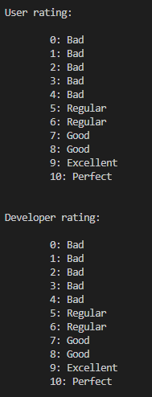  
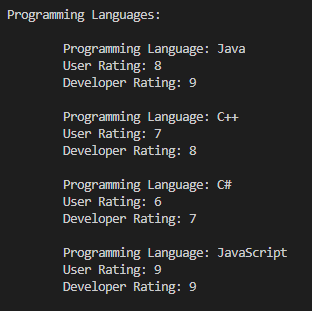  

### AppSpringBoot in Postman and Endpoints

To configure the user's name, password, URL for the MariaDB database connection, and such, you will need to go to the `application.properties` file in `src/main/resources` folder.   

You can test the endpoints in Postman:   

[](https://god.gw.postman.com/run-collection/26400016-52e5e2b9-d189-47fb-b0c7-dad85356eaa0?action=collection%2Ffork&collection-url=entityId%3D26400016-52e5e2b9-d189-47fb-b0c7-dad85356eaa0%26entityType%3Dcollection%26workspaceId%3Db6e3eeac-770e-4cce-8f61-a31866271e87)   

If you don't have Postman, you can also use the command `curl` in the terminal (if you're on Windows, maybe you will need to use the Git Bash terminal) to execute the endpoints. Here are some examples:

```
curl -X GET http://127.0.0.1:8080/programming-languages/get/all
curl -X GET http://127.0.0.1:8080/programming-languages/get/{id}
curl -d "{\"name\": \"Python\", \"userRating\": 9, \"devRating\": 8}" -H "Content-Type: application/json" -X POST http://127.0.0.1:8080/programming-languages/create
curl -d "{\"name\": \"Python\", \"userRating\": 7, \"devRating\": 6}" -H "Content-Type: application/json" -X PUT http://127.0.0.1:8080/programming-languages/update/{id}
curl -X DELETE http://127.0.0.1:8080/programming-languages/delete/{id}
```

#### Create

Creates an item in the `programming_language` table. `create` can be used with or without especifying the ID, as even if you don't, the application is configured to automatically assign an ID to the item created.   

```
http://127.0.0.1:8080/programming-languages/create
```

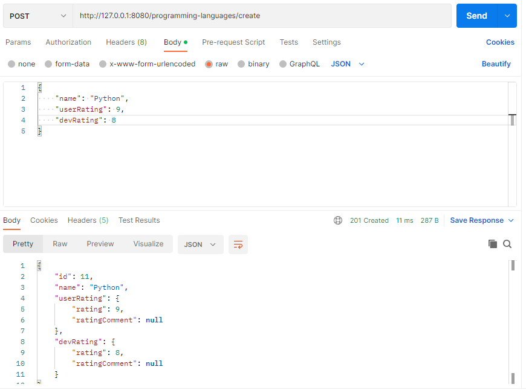   

If you don't assign an ID, it's possible you will see something like `"ratingComment": null` on the return response. Don't worry, it's not an error. The item have been created correctly and if you do `get` to see the item, you will find the `ratingComment` are no longer null but properly assigned.   

If this bothers you, you can avoid it assign an ID before creating the item. However, keep in mind that if it is an ID that has already been used previously but the item to which was assigned upon not longer exists in the database, upon creating the item, the ID specified on the Request Body will be ignored and instead it will assign the item a new ID that has not been used already.   

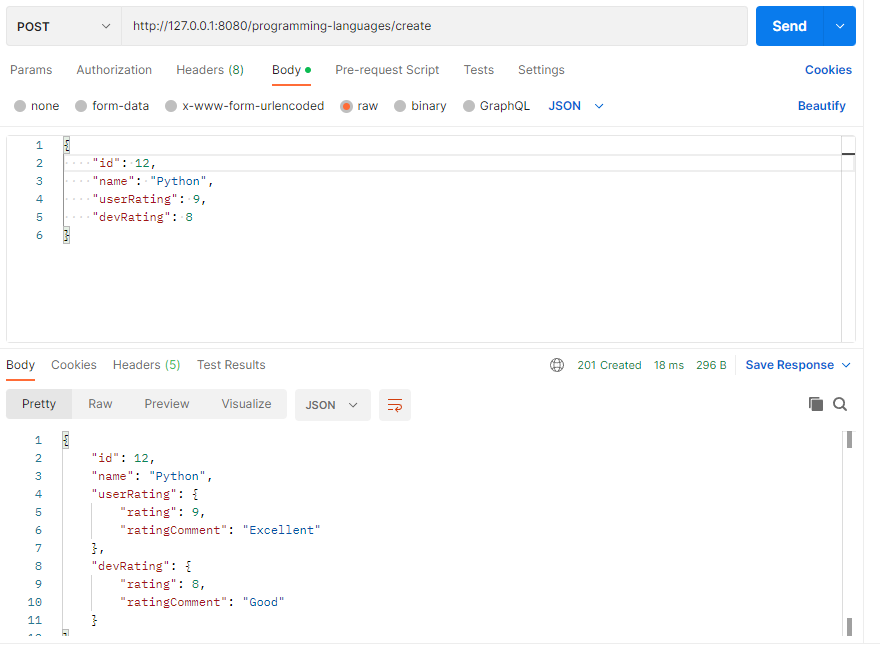   

#### Get all

Gets all the items in the `programming_language` table.   

```
http://127.0.0.1:8080/programming-languages/get/all
```

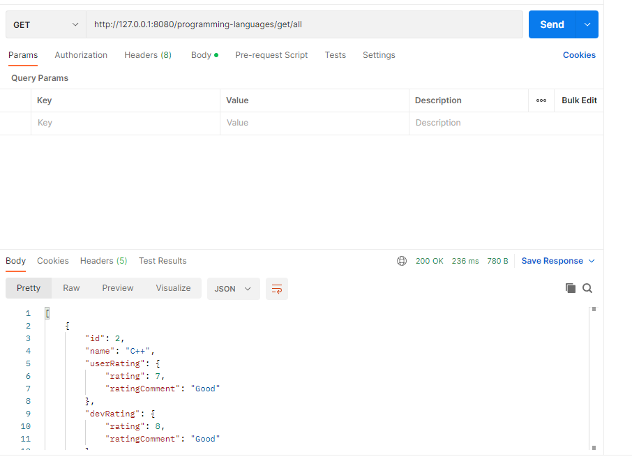   

#### Get one

Gets the item especified from the `programming_language` table.   

```
http://127.0.0.1:8080/programming-languages/get/{id}
```

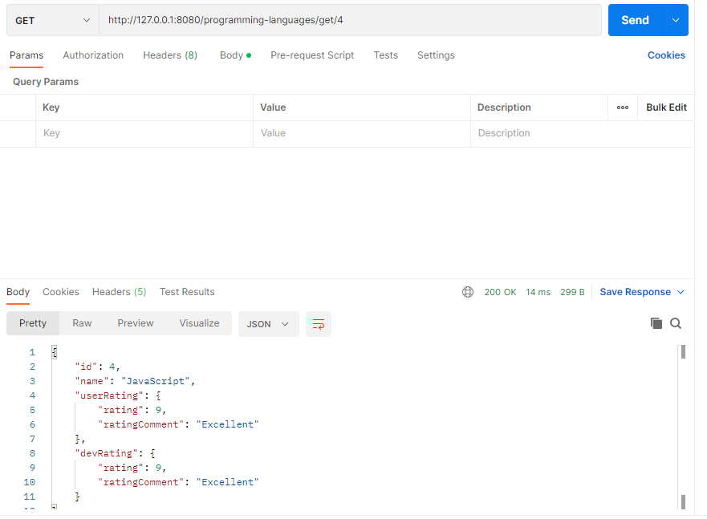 

#### Update

Updates the item especified from the `programming_language` table. You will need to specify the data updated in the Request Body.   

```
http://127.0.0.1:8080/programming-languages/update/{id}
```

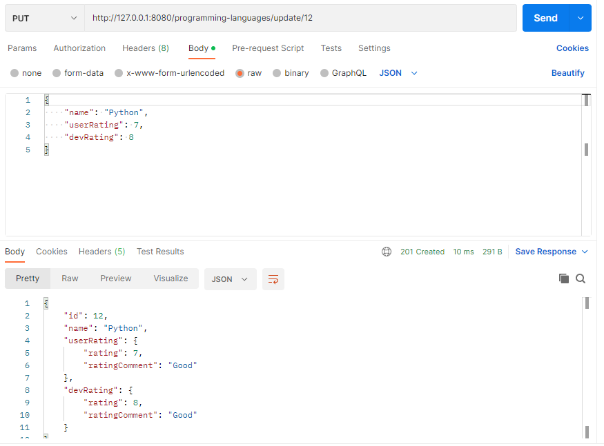 

#### Delete

Deletes the item especified from the `programming_language` table. There's no need to specify the data deleted in the Request Body, with the id on the endpoint it's enough.   

```
http://127.0.0.1:8080/programming-languages/delete/{id}
```

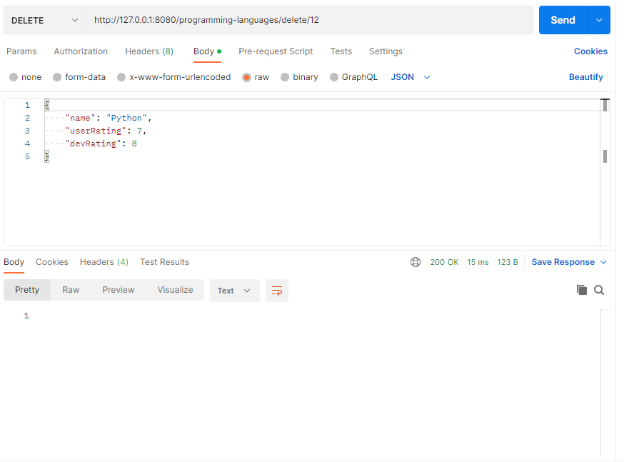 

## Testing

To run the tests, you will need to run the `docker-compose up` command to start the containers and then enter inside the app container with this command:   

```
docker exec -it mariadb-springboot bash
```

Once inside, the only thing you need to do is run the maven command to start the tests:   

```
mvn test
```

This will run all the tests cases created and output if they were successful or not.   

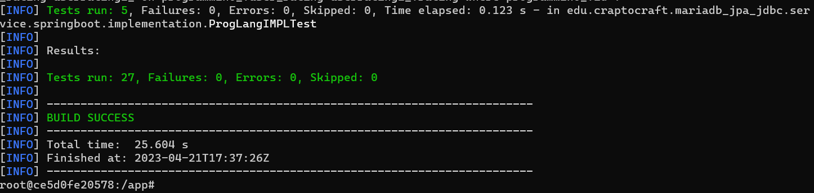 
